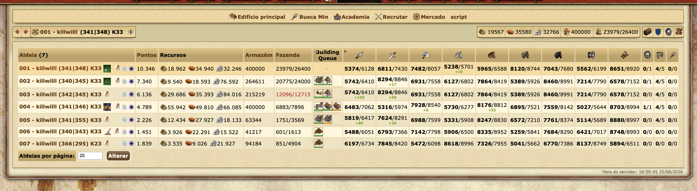
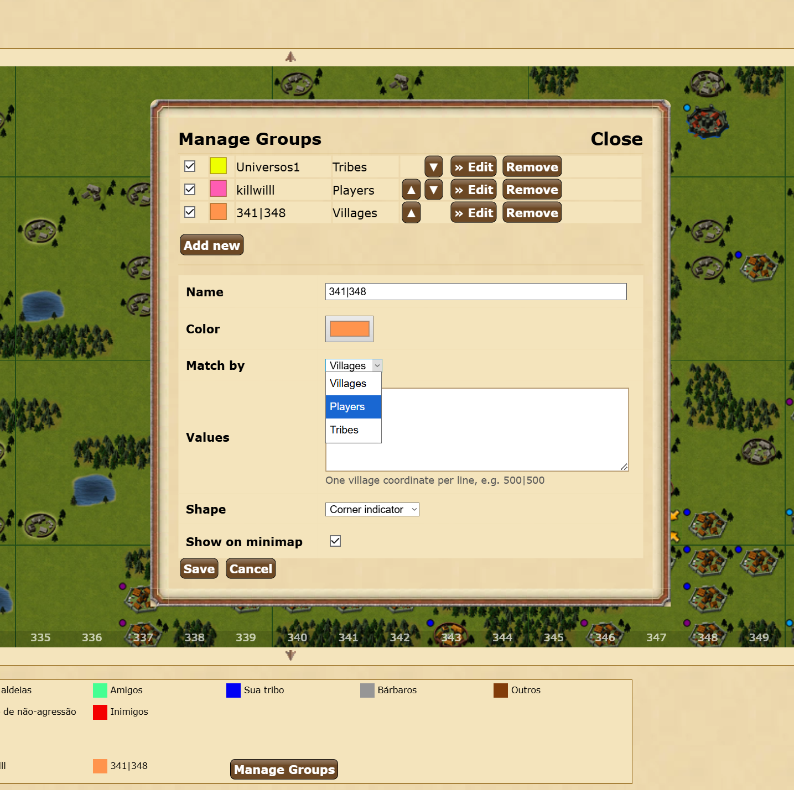
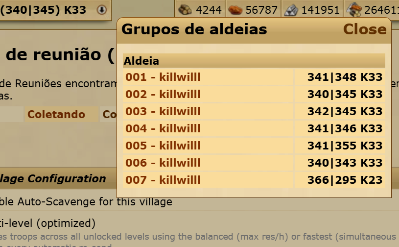
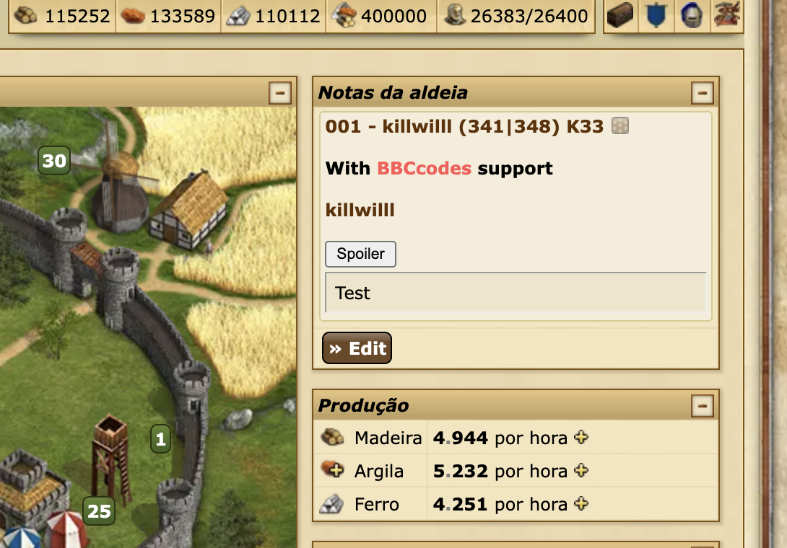
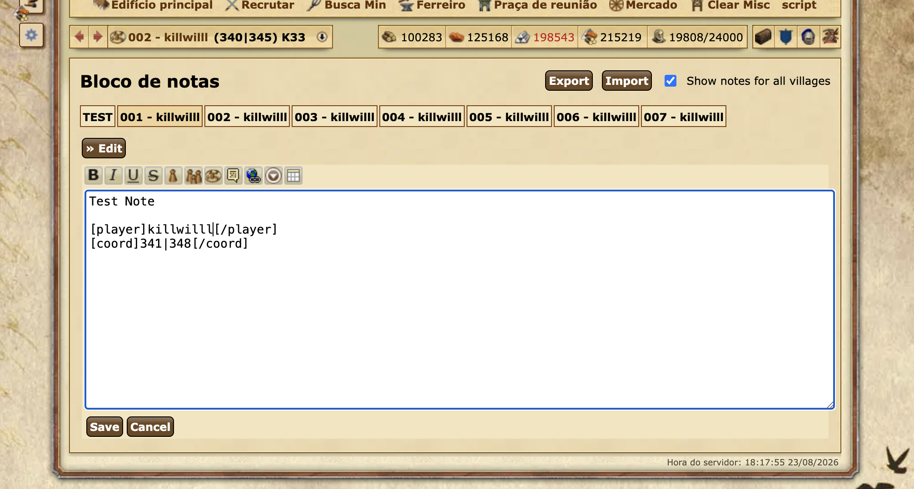
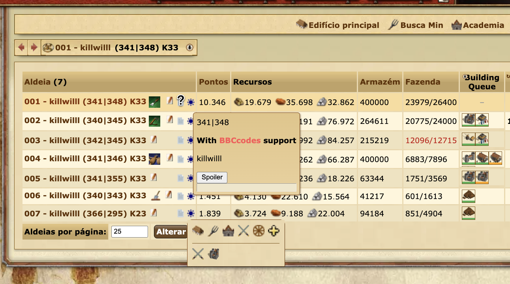
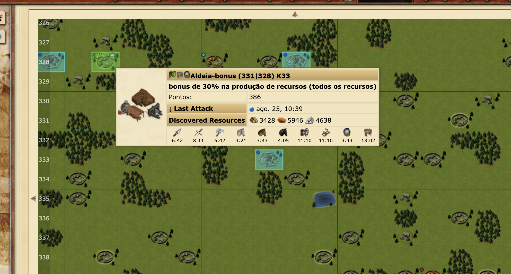
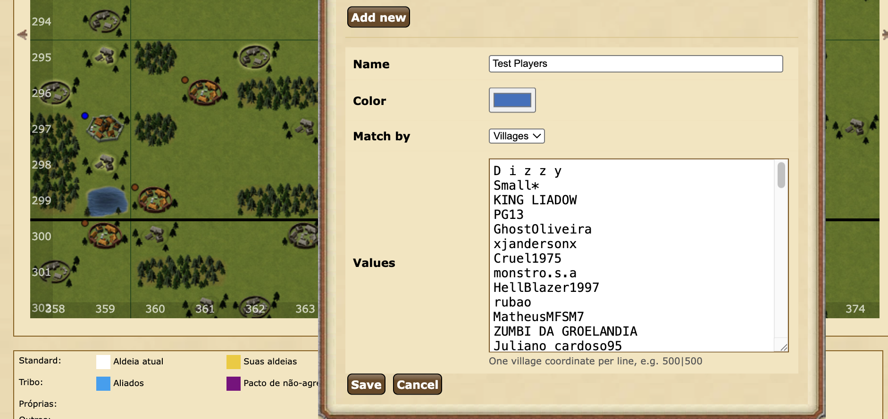
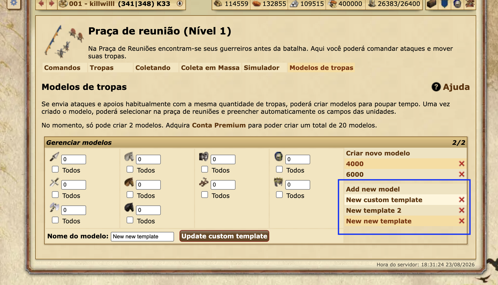
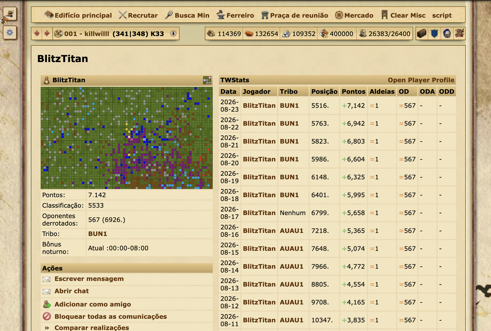

# Tribalwars: Premium Features

A desktop userscript that adds practical tools for managing TribalWars villages, maps, reports and routine tasks.

Some features reproduce conveniences normally associated with a Premium Account. Others are independent utilities. Automation is optional and may not be allowed on every world.

<table>
	<tr>
		<td></td>
		<td></td>
	</tr>
	<tr>
		<td></td>
		<td></td>
	</tr>
</table>

> **Important:** This project is intended for players **without** an active Premium Account. Some features may not work at all or may have compatibility issues.

## Requirements

- Tampermonkey or another userscript manager that supports `@require`.
- A desktop browser. Mobile pages are ignored.
- A TribalWars address matching `https://*.tribalwars.*/*`.

## Installation

Install the published script from [main.user.js](main.user.js), or use the raw GitHub URL:

`https://github.com/joelcosta2/Tribalwars_Script/raw/master/main.user.js`

After installation, open the script settings in TribalWars and enable the features you need. Most features are disabled or configurable individually.

## Features

### Navigation and Widgets

Village List

> Shows all villages in a quick-access widget. The list is refreshed when the cached data is incomplete.

Village Navigation

> Adds previous and next village controls. The `A` and `D` keys can also be used to switch villages.

Custom Navigation Bar

> Create shortcuts to frequently used TribalWars pages and arrange them in your preferred order.

Village Notepad

> Keep a separate note for each village. The editor supports common BBCode tags and resolves players, tribes and coordinates from game data.

Notepad Page

> Notes for every village can be managed from the notepad page. Notes can be exported and imported as JSON.

Recruitment Widget

> Recruit troops from the sidebar. Costs, population, resources, training queues and the maximum affordable amount update as you edit the form.

Building Queue Widget

> Manage upgrades from the sidebar. The script can keep a local waiting queue and submit upgrades when resources and server slots are available.

### Overview

Visual Building Overview

> Adds building levels, resource information and queue timers to the overview page.

Overview Villages

> Enhances the all-villages overview with building queues, one troop column per unit type, storage fill times, village notes and quick links.

> This view requires at least two villages. Troop values may need a manual refresh and can be temporarily stale.

Storage Timer

> Hover over the resource bars or storage values to see the estimated time until storage is full.

### Map and Commands

Large Map

> Use a larger map and choose its size from the map controls.

Map Hover Information

> Shows recent attack information, loot, discovered resources, morale and other village details when hovering over the map.

Outgoing Commands and Travel Times

> Displays outgoing command icons and calculates travel times for available unit types.

Attack Heatmap

> Highlights villages according to the frequency and recency of attacks found in stored reports. - NOT WORKING

Custom Map Groups

> Create coloured groups matching village coordinates, players or tribes. Groups are stored per world and player, and the first matching group takes priority.

Troop Templates

> Create, edit, delete and apply custom troop templates in command forms and map attack menus.

Map Quick Action Buttons

> Adds quick action buttons to the map context menu for quick attacks using saved troop templates, quick reservations and quick addition of villages to map groups.

Map SDK

> The local SDK adaptation is based on the Map SDK by Thomas "Sass" Ameye: https://shinko-to-kuma.com/scripts/mapSdk.js. Thank you to the author for providing the original foundation.

### Reports and Simulator

Report to Simulator

> Opens the simulator with attacker troops, defender troops, away defenders, wall level, luck, morale, religion and applicable buffs filled from an attack report.

TWStats Player History

> Adds extra player history and ranking information to player profiles using a request to TWStats.

> This feature depends on the external `twstats.com` service and may stop working if its pages or availability change.

### Automation

Auto Daily Bonus

> Collects the daily bonus when it is available and schedules the next check using server time.

Auto Build Instant Free

> Completes an eligible active building upgrade during TribalWars' final three-minute free window.

### Interface and Settings

Settings

> Enable or disable features, arrange widgets, configure automation and export or import all script settings as JSON.

Languages

> The interface is available in English and Portuguese.

Small Interface Improvements

> Optional utilities include hiding Premium promotions, redirecting training buildings to recruitment pages and keeping the page active while it is open.

Bot Protection Handling

> When TribalWars displays an anti-bot screen, the script can stop its features automatically to prevent continuous requests while the protection is active, helping reduce the risk of bans. This behavior is controlled in the settings.

## Data and Limitations

- IndexedDB stores structured data for build queues, recruitment data, reports, notes and map data.
- `localStorage` stores settings and selected world- or player-specific data.
- The extra building queue is a local waiting queue. It does not increase the server's real queue limit: normally two slots for free accounts and five for Premium accounts.
- The browser tab must remain open for the local build queue and scheduled automation to run. (It's not recommended to leave the tab open on *overview_villages* page.)
- Mobile pages are not supported.
- Some overview and troop data is cached and may require a refresh.
- Map and report information depends on the data available from TribalWars pages.
- The script includes server-timezone handling and is expected to work across different countries and worlds. Some features scrape HTML text, so language or markup changes may cause problems. Please report them so they can be investigated.
- The custom quick-link source and some anti-bot cache/offline settings are not implemented.
- The dark-mode module exists in the codebase but is not currently exposed as an active setting.

## Local Development

[main.user.js](main.user.js) is the distributable entry point and loads the published files from GitHub.

[main_local.user.js](main_local.user.js) is the local-development entry point. Its `@require` paths must point to local files using the `file:///...` format. In Tampermonkey, enable **Allow access to file URLs** for the browser extension.

Edit the feature files directly, then reload the TribalWars page to test them. Reinstall the local userscript only when changing its metadata or local `@require` paths.

## License and Disclaimer

This project is licensed under the [Personal Use License](LICENSE).

The code may be used, copied and modified for personal, non-commercial purposes only. Selling the project, selling modified versions, sublicensing it or including it in a commercial product or service is not permitted without prior written permission from the author.

This project is not affiliated with, endorsed by or sponsored by InnoGames or TribalWars. TribalWars and InnoGames are trademarks of their respective owners.

This project is provided for personal use and experimentation. Automation may violate the Terms of Service or local rules of a TribalWars world.

The software is provided "as is", without guarantees of availability, accuracy or compatibility. It may not work on every world, country, language or game version. Some features interact with external services or parse TribalWars HTML, which may change without notice.

The building queue is a separate feature from these bots and has reportedly worked with at least 10 villages without a ban.

> **A note from an entirely unnamed experimental subject:** “The queue works. Tested with 10 villages. Still not banned.”

Enable automation only if you accept the risks. The author is not responsible for bans, restrictions or data loss.
