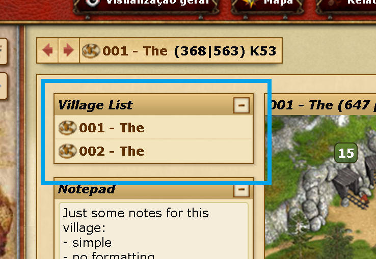
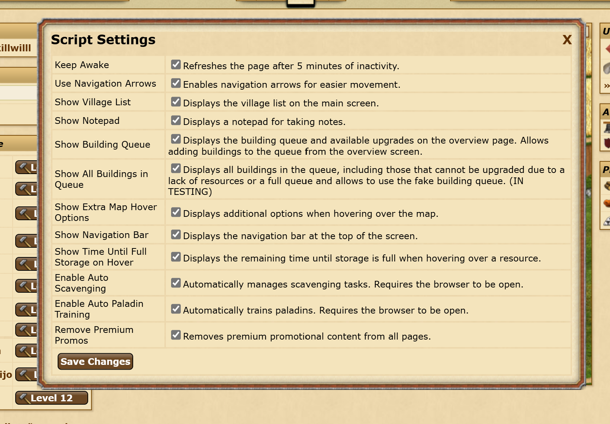

# Tribalwars_Script

## Description

Tribalwars_Script is a collection of scripts designed to enhance the gaming experience in Tribalwars. These scripts provide additional features that are typically available only to premium users, along with other useful options. A new column on the left of the main screen has been added. New assets added by this script will remember the position on the main screen.

## Key Features

- **Arrows for Changing Villages:** Seamlessly navigate between villages using intuitive arrow controls.
  
  

- **Village List for Easy Selection:** Quickly access a comprehensive list of villages for efficient selection.
  
  

- **Notes for Each Village:** Stay organized by adding important notes to individual villages for easy reference.
  
  

- **Extra Village Information on Map Hover:** Gain valuable insights with additional village information displayed on map hover. Details include the last raid performed, resources detected in the last attack, date of the last attack, and ongoing attack or return.
  
  

- **Extra Building Queue:** The idea is to create a kind of expanded queue to program the queue with more than 2 buildings only (similar to what is possible with premium).
  
  

- **Navigation Bar:** Possibility of having a navigation bar, where you can add shortcuts to various pages. Currently, the shortcuts are hardcoded (you can edit them directly in the code).
  

- **Remove Premium Promos:** Remove advertising for premium promotions, like the examples:
  
  
  

- **Script Settings:** Customize your gameplay experience with in-game settings to control various aspects of the script. Adjust settings to suit your preferences and gameplay style. (More options will be added;)
  
  

## How to Use

These scripts are intended for use with Tampermonkey, a popular userscript manager for web browsers.

1. **Install Tampermonkey:** If you haven't already, install the [Tampermonkey extension](https://www.tampermonkey.net/) for your web browser.
2. **Install the Script:**
   - Open Tampermonkey and navigate to the "Utilities" tab.
   - In the "Import from URL" field, paste the following link: `https://github.com/joelcosta2/Tribalwars_Script/archive/refs/heads/master.zip`.
   - Click "Install" to add the script to Tampermonkey.
3. **Import the Script:** After installation, click "Import" to import the script into Tampermonkey.

## Notes

- These functionalities only work on the browser and have only been tested with one account/world. Support for multiple accounts or worlds may be added in the future.
- All information is saved in browser cookies.
- The default TW assets on the main screen currently are not able to keep the position after refresh. (Bug to fix)
- Some information is fetched from an AJAX call to the corresponding page, for example, to get the information on village hover (regarding last attacks info) this will get the page to that specific report and scrap the info out of it to show on the map. I'm currently trying to decrease the number of calls to prevent the bot catch tool from TW and diminish the probability of ban.
- By the way, I'm not responsible for any ban resulting from the use of this script. It is intended to be used moderately to increase the gameplay of a casual player without any intention of gaining an advantage over other players.

Enjoy the enhanced features while playing Tribalwars!
