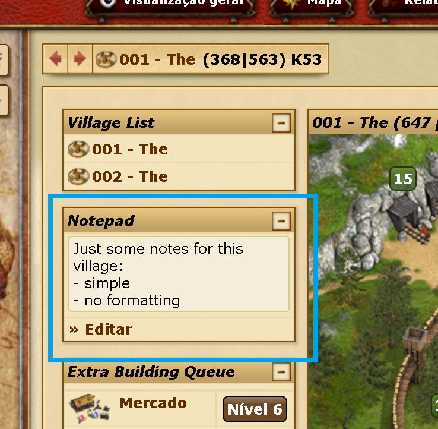
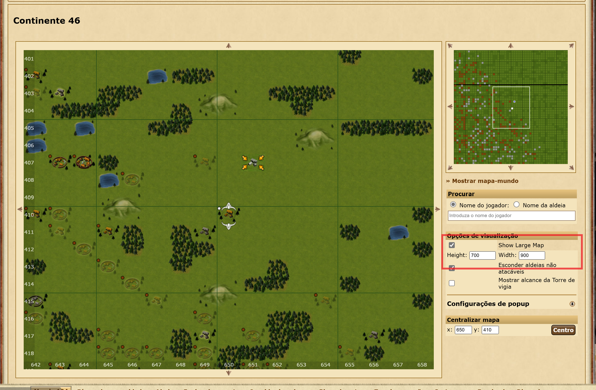
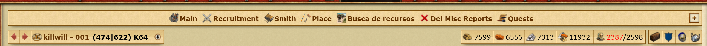
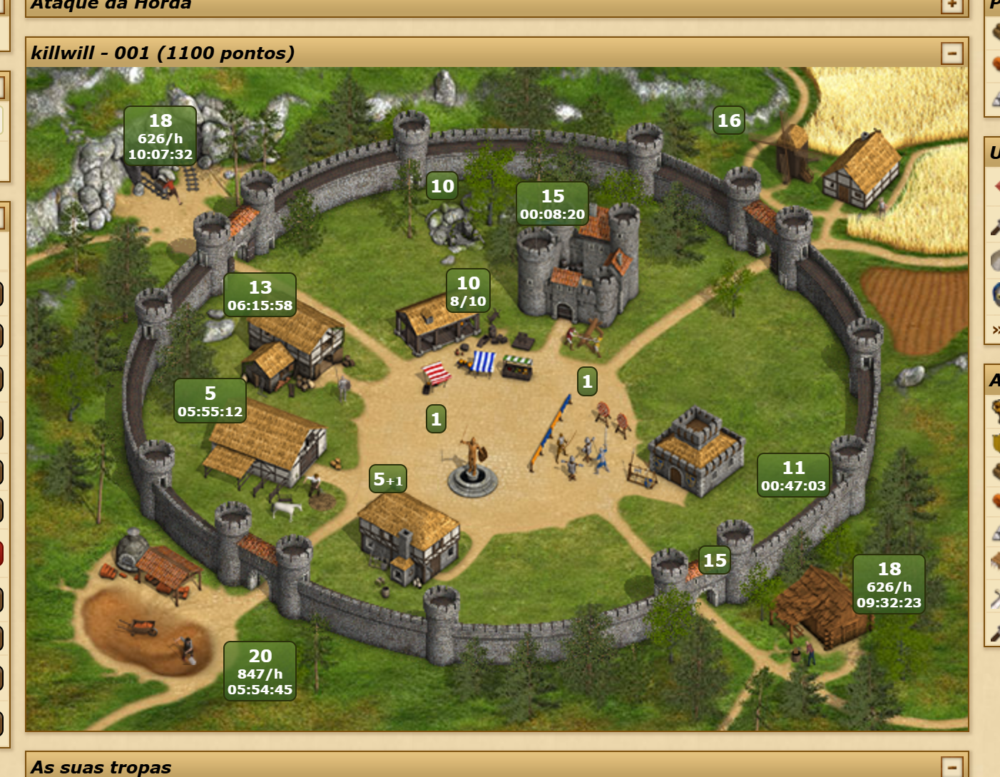

# Tribalwars_Script

## Description

Tribalwars_Script is a collection of scripts designed to enhance the Tribalwars gaming experience. It introduces several premium-like features, such as an expanded building queue, additional navigation options, a larger map, and extra village information. The script adds a new column to the left of the main screen, and the widgets it introduces will remember their position on the screen. With these features, the gameplay experience is streamlined, offering users more control and convenience while playing, even without a premium account.

## Key Features

- **Arrows for Changing Villages:** Seamlessly navigate between villages using intuitive arrow controls.
  
  

- **Village List for Easy Selection:** Quickly access a comprehensive list of villages for efficient selection.
  
  

- **Notes for Each Village:** Stay organized by adding important notes to individual villages for easy reference.
  
  

- **Extra Large Map:** Enjoy a larger map without premium. Toggle it on the map page and set the size freely—no limits!
  
  

- **Extra Village Information on Map Hover:** Gain valuable insights with additional village information displayed on map hover. Details include the last raid performed, resources detected in the last attack, date of the last attack, and ongoing attack or return.
  
  

- **Building queue:** Conveniently manage your building queue from the overview page by easily adding or removing buildings without navigating through multiple menus.
  
  

- **Extra Building queue:** The idea is to create an expanded queue that allows programming the queue with more than two buildings (similar to what is possible with premium). You can disable this and use it only to add/remove from the actual game's queue from the overview page.
Currently, it works as follows: green represents the building being upgraded, orange indicates buildings in the game's actual queue, and red shows buildings in the fake queue. Requires the browser to be open. CURRENTLY IN BUG FIXING
  
  

- **Navigation Bar:** Possibility of having a navigation bar, where you can add shortcuts to various pages. Currently, the shortcuts are hardcoded (you can edit them directly in the code).
  

- **Storage Fill Time on Resource Hover:** Monitor your resource storage more effectively by hovering over the resource bar, you can now see the estimated time remaining until each resource (wood, stone and iron) reaches maximum capacity. 
  

- **Premium info Overview Screen:** Access additional details directly on the overview page, such as the time remaining for the storage to fill or the status of each individual resource. (In progress – i'm working on replicating features typically available only to Premium users.) CURRENTLY WITHOUT INDIVIDUAAL OPTIONS
  
  

- **Remove Premium Promos:** Remove advertising for premium promotions, like the examples:
  
  
  

- **Script Settings:** Customize your gameplay experience with in-game settings to control various aspects of the script. Adjust settings to suit your preferences and gameplay style. (More options will be added;)
  
  

- **Auto Scavenging/Paladin Train:** Adds automation for training the Paladin (always choosing the cheapest option) and/or automating Scavenging (for now, using all available troops at the highest available level).

## How to Use

These scripts are intended for use with Tampermonkey, a popular userscript manager for web browsers.

1. **Install Tampermonkey:** If you haven't already, install the [Tampermonkey extension](https://www.tampermonkey.net/) for your web browser.
2. **Install the Script:**
   - Open Tampermonkey and navigate to the "Utilities" tab.
   - In the "Import from URL" field, paste the following link: `https://github.com/joelcosta2/Tribalwars_Script/archive/refs/heads/master.zip`.
   - Click "Install" to add the script to Tampermonkey.
3. **Import the Script:** After installation, click "Import" to import the script into Tampermonkey.

## For Those Who Want to Develop with This
1. **Download project:**
   - Download or clone the project to your local machine.
2. **Change you project file path:**
   - Edit the **main_local.user** file, and past follow settings on the file, replacing YOUR_PATH:
        ```javascript
      // @require      file://C:\{YOUR_PATH}\Tribalwars_Script\utils.user.js
      // @require      file://C:\{YOUR_PATH}\Tribalwars_Script\custom_css.user.js
      // @require      file://C:\{YOUR_PATH}\Tribalwars_Script\settings_script.user.js
      // @require      file://C:\{YOUR_PATH}\Tribalwars_Script\navigationArrows_script.user.js
      // @require      file://C:\{YOUR_PATH}\Tribalwars_Script\map_script.user.js
      // @require      file://C:\{YOUR_PATH}\Tribalwars_Script\overviewPremiumInfo.user.js
      // @require      file://C:\{YOUR_PATH}\Tribalwars_Script\bot_trainerPaladin.user.js
      // @require      file://C:\{YOUR_PATH}\Tribalwars_Script\bot_scavenging.user.js
      // @require      file://C:\{YOUR_PATH}\Tribalwars_Script\widget_villageList.user.js
      // @require      file://C:\{YOUR_PATH}\Tribalwars_Script\widget_notepad.user.js
      // @require      file://C:\{YOUR_PATH}\Tribalwars_Script\widget_extraBuildQueue.user.js
      // @require      file://C:\{YOUR_PATH}\Tribalwars_Script\widget_recruitTroops.user.js
      // @updateURL    file://C:\{YOUR_PATH}\Tribalwars_Script\1main.user.js
      // @downloadURL  file://C:\{YOUR_PATH}\Tribalwars_Script\1main.user.js

   
3. **Import the main file on Tampermonkey:**
   - Open Tampermonkey and navigate to the "Utilities" tab.
   - In the "Import from file" field, select the **main_local.user**.
   - Click "Install" to add the script to Tampermonkey.
4. **Make your changes:**
   - Edit the scripts and test them directly in your browser. You only need to reinstall the script if you make changes to the **main_local.user** file
5. **Make sure you have Allow access to file URLs for Tampermonkey(TP):**
   - Go to Extensions on your browser and find the TM 'card'.
   - Click details and "Allow access to file URLs".
   
  

6. **Notice the file:// URI scheme:**
      - for windows:

            // @require   file://C:\path\to\userscript.user.js

      - for macOS and *nix:

            // @require   file:///path/to/userscript.user.js

## Notes

- These features currently work only in the browser and have been tested with a single account/world. Support for multiple accounts or worlds may be added in the future.
- All data is stored in the browser's local storage.
- I have no idea how it works in languages other than PT-PT. Feel free to test it and let me know! :)
- I doubt it works with different time formats...
- Some information is retrieved via AJAX calls to the relevant pages. For example, village hover info (such as recent attack details) is scraped from the corresponding report page and displayed on the map. I'm working on reducing the number of calls to avoid detection by TW’s bot-catching system and minimize the risk of bans.
- I know this is basically spaghetti code, but I'm having a lot of fun getting it to work. I just wish my villages weren’t constantly being conquered—it makes it hard to test this with multiple villages. Maybe I should focus more on the game and less on the script!
- Just a heads-up: I’m not responsible for any bans resulting from using this script. It’s meant for casual gameplay enhancement, not to provide an unfair advantage over other players.

Enjoy the enhanced features while playing Tribalwars!
